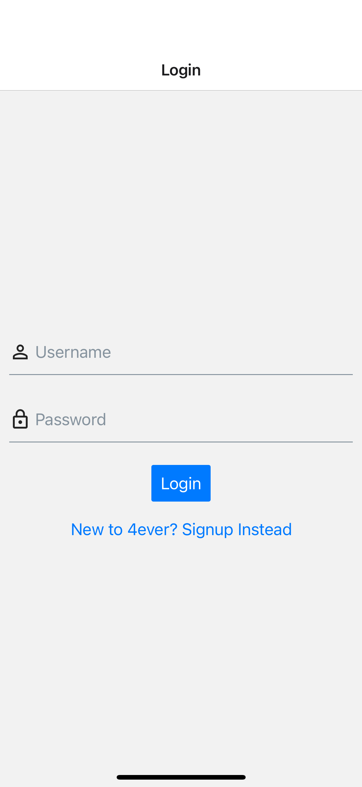
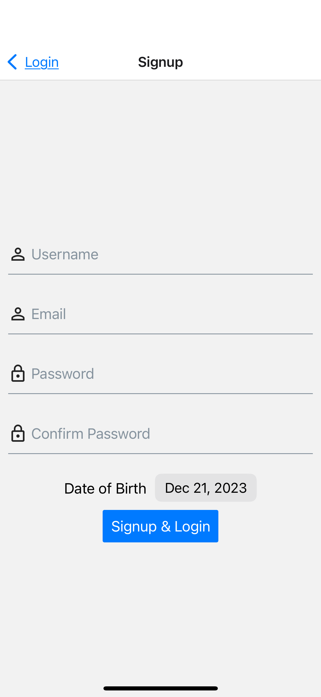
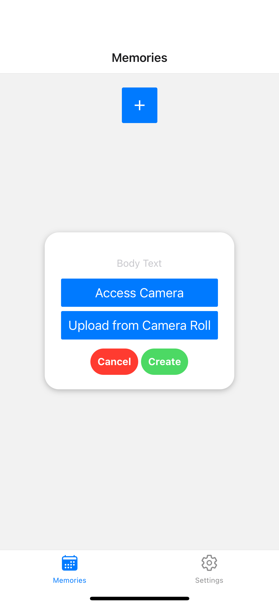
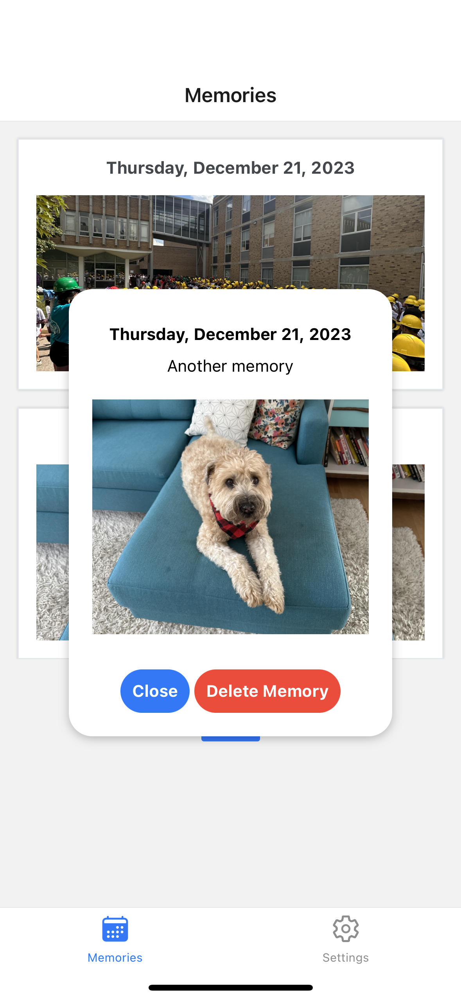
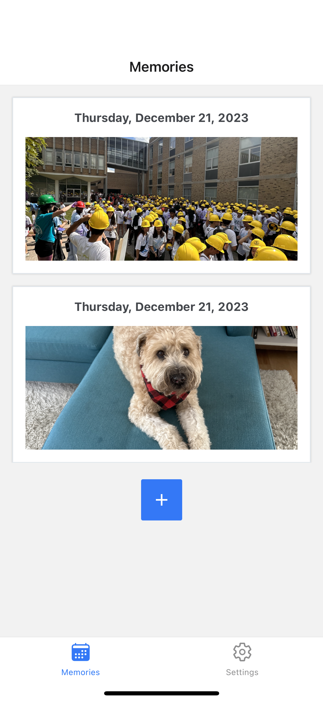

# 4ever - Memory Keeper Application

## Photos - iOS Testing

## Description

This is the React Native (with Expo) application used to interact with the 4ever platform.

It implements user account configuration and memory uploading, editing, and deleting. Image uploading is handled on the device to AWS S3.

_The accompanying backend can be found [here](https://github.com/jordynmindorff/4ever-api)._

